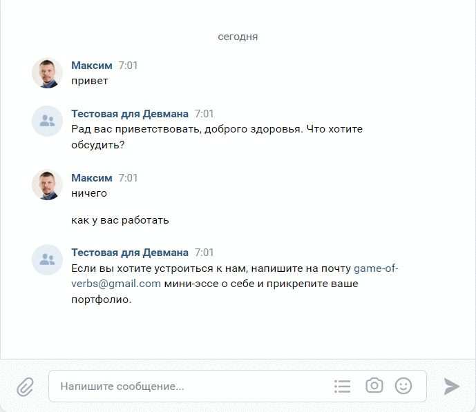

# Телеграм-бот и ВК-бот обучаемые нейросетью для ответов

Это чат боты ВК и телеграм, который ловят сообщение от пользователя 
либо из телеграм или из группы в ВК. Далее это сообщение отправляется в нейросеть [Dialogflow ES](https://dialogflow.cloud.google.com/#/getStarted)
там подбирается подходящий ответ и он приходит пользователю

## Примеры работы ботов:
Телеграм бот


ВК бот


Работу бота можно посмотреть скачав телеграм бот 
```
https://t.me/AnikeevBot
```
Или написав в группу в ВК "Тестовая для Девмана"
```
https://vk.com/club214461314
```
## Запуск:

### 1. Копируем содержимое проекта себе в рабочую директорию
```
git clone <метод копирования>
```
У вас будет 3 рабочие файла:
- speach_bot.py - этот файл для работы с ТГ ботом
- vk_speach_bot.py - это файл для работы с ВК
- intent.py - это файл для создание "намерения" через код, но можно и на сайте

### 2. Устанавливаем библиотеки:
```
pip install -r requirements.txt
```

### 3. Для работы с Dialogflow ES необходимо там зарегестрироваться и [создать проект](https://cloud.google.com/dialogflow/es/docs/quick/setup) и [агента](https://cloud.google.com/dialogflow/es/docs/quick/build-agent):
После прохождение этих шагов у вас должно быть `PROJECT_ID` и созданный файл `.json`  вашими данными для авторизации

### 4. Для хранения переменных окружения создаем файл .env:
```
touch .env
```
Для тестирования телеграм-бота добавляем токен в `.env` файл: `TG_BOT_TOKEN='токен вашего бота'`

Для работы с Dialogflow ES в `.env` файл: `PROJECT_ID='ваш PROJECT_ID полученный при создании проекта'`
А также `GOOGLE_APPLICATION_CREDENTIALS='путь куда вы сохранили .json файл с авторизацией'`

Для тестирования ВК-бота добавляем токен в `.env` файл: `VK_TOKEN='токен группы в ВК куда бот будет отправлять сообщения'`
### 5. Запуск

```
python speach_bot.py  
```
### 6. Тренировка бота (загрузка намерения)
Тренировку бота можно сделать на сайте Dialogflow на странице агента в разделе `Intent`. 
Указываете тренировочные фразы, которые может вводить пользователь, и ваш ответ.

Также это можно сделать через программу `intent.py`. Для этого понадобится файл `.json` следующего содержания:

```pycon
{
    "Устройство на работу": {
        "questions": [
            "Как устроиться к вам на работу?",
            "Как устроиться к вам?",
            "Как работать у вас?",
            "Хочу работать у вас",
            "Возможно-ли устроиться к вам?",
            "Можно-ли мне поработать у вас?",
            "Хочу работать редактором у вас"
        ],
        "answer": "Если вы хотите устроиться к нам, напишите на почту game-of-verbs@gmail.com мини-эссе о себе и прикрепите ваше портфолио."
    },
    "Забыл пароль": {
        "questions": [
            "Не помню пароль",
            "Не могу войти",
            "Проблемы со входом",
            "Забыл пароль",
            "Забыл логин",
            "Восстановить пароль",
            "Как восстановить пароль",
            "Неправильный логин или пароль",
            "Ошибка входа",
            "Не могу войти в аккаунт"
        ],
        "answer": "Если вы не можете войти на сайт, воспользуйтесь кнопкой «Забыли пароль?» под формой входа. Вам на почту прийдёт письмо с дальнейшими инструкциями. Проверьте папку «Спам», иногда письма попадают в неё."
    }}
```

Запуск файла. 
```
python intent.py  
```

Программа спросит откуда ей взять необходимый файл.
```pycon
Выберите откуда скачивать файл с данными (.json). 1 - с сервера, 2 - с локального компьютера
```
Выбираете либо 1 - с сервера и указываете адрес сервера, пример:
https://dvmn.org/media/filer_public/a7/db/a7db66c0-1259-4dac-9726-2d1fa9c44f20/questions.json

Или указываете адрес папки и название файла .json на вашем компьютере.

Далее программа спросит вас:
```pycon
Укажите название намерения без кавычек или если хотите скачать все намерения из файла напишите all
```
Здесь указываете либо отдельное намерение, например, `Забыл пароль` тогда информация, 
с данным названием намерения загрузится на сайт. Или пишите `all` и тогда все намерения 
из файла загрузяться на сайт.

## Цели проекта

Код написан в учебных целях — это урок в курсе по Python и веб-разработке на сайте [Devman](https://dvmn.org).